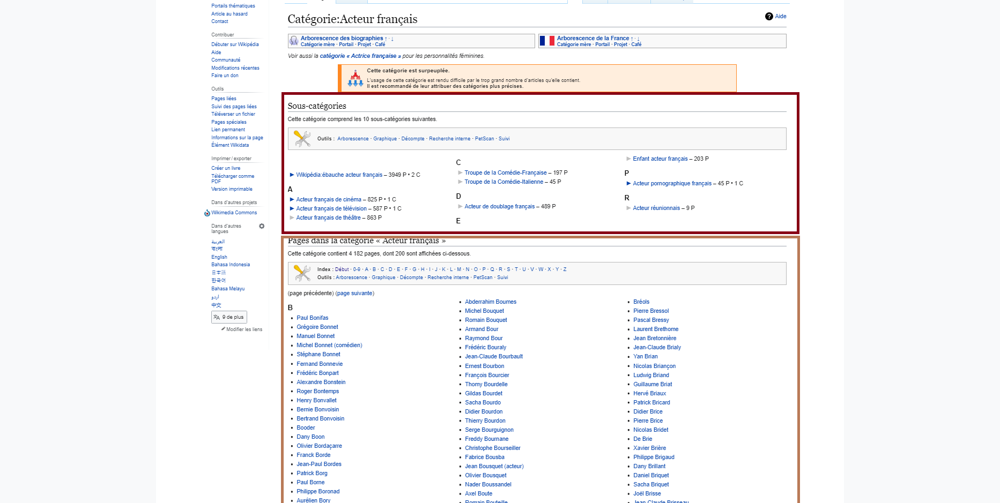
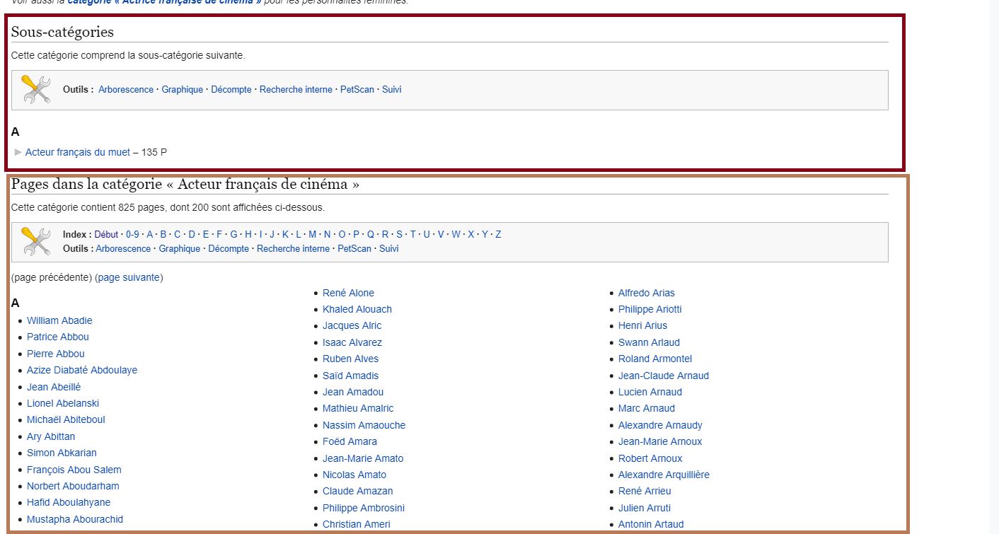
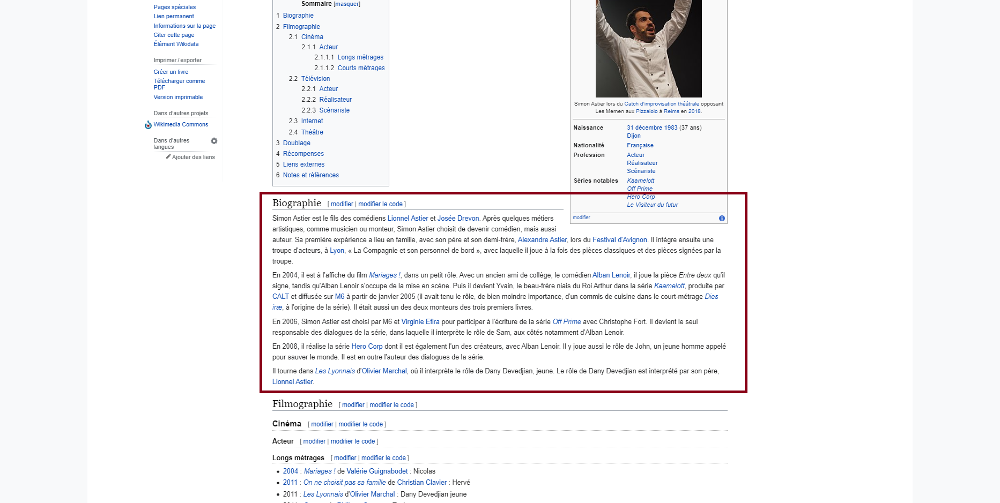
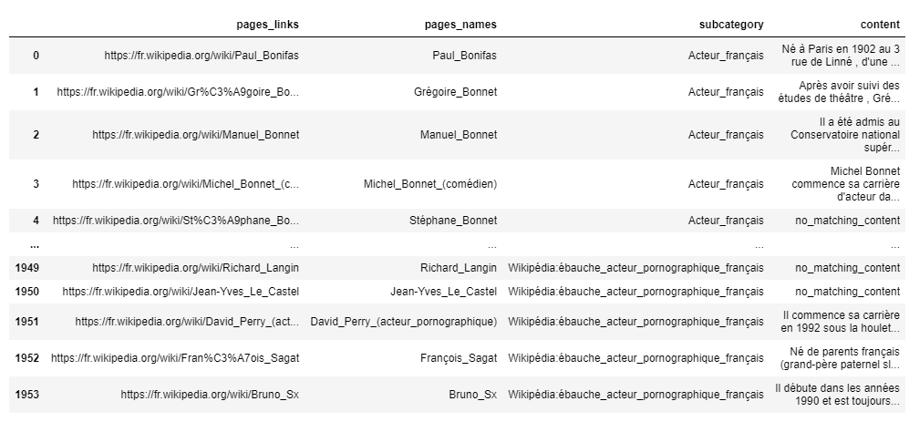
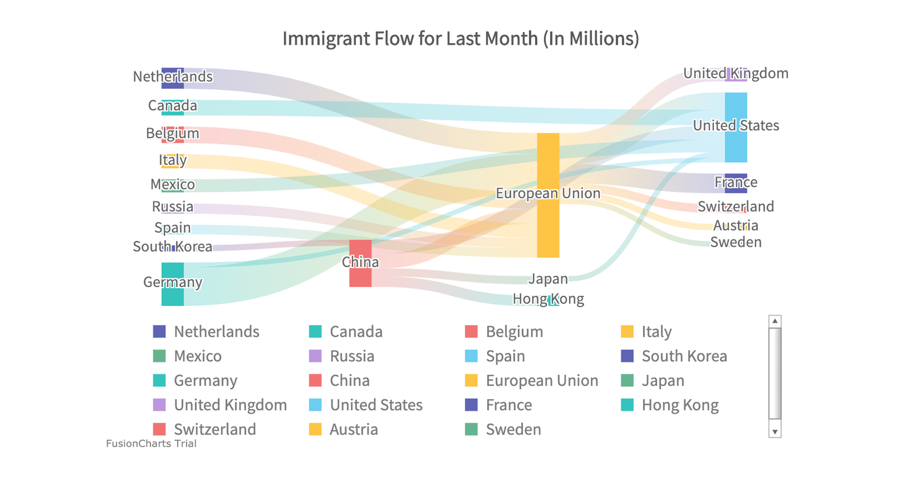
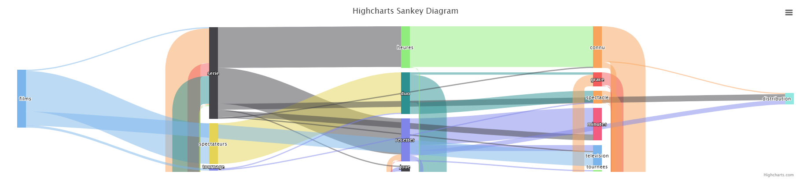

[](https://badge.fury.io/py/highway-star)
[](https://www.codacy.com/gh/matheo-daly/highway_star/dashboard?utm_source=github.com&amp;utm_medium=referral&amp;utm_content=matheo-daly/highway_star&amp;utm_campaign=Badge_Grade)
[](https://colab.research.google.com/github/matheo-daly/highway_star/highway_star_demo.ipynb]
# highway_star
>Scrap biographies from wikipedia categories and plot their life courses

The main goal of this project is to retrieve all biographies from a desired wikipedia category, and to plot the life course of those persons 
with a sankey diagram. Those data could then be analyzed for social purpose. <br>
This project was made in partnership with the [LEIRIS](https://www.univ-montp3.fr/fr/<nolink>/toutes-les-unités-de-recherche/leiris-laboratoire-détudes-interdisciplinaires-sur).
## Installation

---
You can install the project via `pip`, or any other `Pypi` package manager.

```bash
pip install highway-star
```

>Note : you may need some more packages from spacy for Natural Language Processing. This may cause error during your execution.
>
>Please run those commands in your console, or in a python script. 

```bash 
pip install https://github.com/explosion/spacy-models/releases/download/fr_core_news_sm-2.0.0/fr_core_news_sm-2.0.0.tar.gz#egg=fr_core_news_sm==2.0.0
```
```bash 
 python -m spacy download fr
```

## How to use

---
### Scrapping

---

>The function above allows you to scrap biographies from every page of the categories and subcategories crawled by this one.
````python
from highway_star.scrapping.wikipedia_scraper import scrap_wikipedia_structure_with_content

content = scrap_wikipedia_structure_with_content(
    root_category="Acteur_français",
    lang="fr")
````
Let's decompose what this function is doing. <br>
Admit that you want all biographies that comes from the wikipedia category [Acteurs_français](https://fr.wikipedia.org/wiki/Catégorie:Acteur_français). <br>
 <br>
The algorithm will get every page link in the orange rectangle, and will store information of every **subcategory** in the red rectangle.<br>
Then, it will repeat this process for every subcategory, until there are no category left. <br>
For example, in the subcategory [Acteur_français_de_cinéma](https://fr.wikipedia.org/wiki/Catégorie:Acteur_français_de_cinéma) of the category [Acteurs_français](https://fr.wikipedia.org/wiki/Catégorie:Acteur_français), 
we still have 1 subcategory, and many new pages to scrap, as shown in the figure just below. <br>
 <br>
Then, when it gets to a page, it will scrap all the content within the tags
````html
<span class="mw-headline" id="Biographie">Biographie</span>
````
and 
````html
</h2>
````
In order to select only the content that we have for example in the image just below. <br>

<br>

The result of this function is a python [dict](https://www.w3schools.com/python/python_dictionaries.asp).
<br> You will just have to convert this dictionary to a dataframe using pandas : 
````python
import pandas as pd
pd.DataFrame.from_dict(content)
````
To have an output like this <br>

<br>
Note that you have here :

*   **page_links** : links to the pages
*   **pages_names** : names of the pages
*   **subcategory** : category where the page was found
*   **content** : the content of the biography that has been scrapped

### Preprocessing

___
>Once you have retrieved your data, you may need to preprocess them. 

In order to do that, we have two functions, one simple, and the other more complex. <br>
#### Easy but not custom way
````python
from highway_star.preprocessing.biography_preprocessor import sent_to_words
sent_to_words(biographies_column=dataframe_with_biographies["biographies"])
````
<br>The result of this will be a python [list](https://www.w3schools.com/python/python_lists.asp) of tokenized biographies.
<br>just add it to your dataframe using
````python
content["biographies_tokenized"] = sent_to_words(biographies_column=dataframe_with_biographies["biographies"])
````
#### Complex but custom way

>Note : To run this function, make sure to install following packages

````bash
pip install https://github.com/explosion/spacy-models/releases/download/fr_core_news_sm-2.0.0/fr_core_news_sm-2.0.0.tar.gz#egg=fr_core_news_sm==2.0.0
python -m spacy download fr
````
````python
from highway_star.preprocessing.biography_preprocessor import remove_stop_words_from_biographies
remove_stop_words_from_biographies(biographies_column=dataframe_with_biographies["biographies"], 
                                   custom_stop_words = ["ajouter", "oui", "être", "avoir"],
                                   use_lemmatization=True,
                                   allowed_postags=['NOUN', 'VERB'])
````
This function does the tokenization, but also : 
*   allows you to choose custom `stop words`
*   filter biographies with `stop words` of the package ```spacy.load('fr_core_news_sm')```
*   allows you to use or not `lemmatization`
*   allows you to filter biographies by [parts of speech](https://en.wikipedia.org/wiki/Part_of_speech) (e.g., 'NOUN', 'VERB').

Default instantiation of this function is 
````python
from highway_star.preprocessing.biography_preprocessor import remove_stop_words_from_biographies
remove_stop_words_from_biographies(biographies_column=dataframe_with_biographies["biographies"])
````
With non filled parameters set to default : 
*   **custom_stop_words** = `None`
*   **use_lemmatization** = `False`
*   **allowed_postags** = `None`

### Visualizing

___

>The visualization is done using Sankey Diagram, and the algorithm [prefixspan](https://pypi.org/project/prefixspan/)
#### Prefixspan
Prefixspan is an algorithm of Data Mining that retrieve the most frequent patterns in a set of data. <br>
It was developed in 2001 by Pei, Han et. al, in [Mining Sequential Patterns Efficiently by Prefix-Projected Pattern Growth](http://hanj.cs.illinois.edu/pdf/span01.pdf). <br>
It can be implemented in python using the Pypi library [prefixspan](https://pypi.org/project/prefixspan/). <br>
Considering that a set of data is a set of biographies, it will retrieve most frequent patterns in our biographies. <br>
We can manage the length of the patterns it will search.<br>
The more your length pattern is high, the more you have a chance that those pattern globe all biographies from the start to the end, but you may not have many patterns.
#### Sankey Diagram
Those are great data visualization tools to plot relational data. <br>

<br>
An implementation could be found in javascript using [Highcharts](https://www.highcharts.com/demo/sankey-diagram). <br>

````python
from highway_star.visualizing.visualizer import give_sankey_data_from_prefixspan
give_sankey_data_from_prefixspan(dataframe_with_biographies["content_tokenized"],
                                 prefixspan_minlen=15,
                                 prefixspan_topk=100)
````
This implementation will find the top `100` patterns of size `15`.
<br>
The basic implementation of this function is : 
````python
from highway_star.visualizing.visualizer import give_sankey_data_from_prefixspan
give_sankey_data_from_prefixspan(dataframe_with_biographies["content_tokenized"])
````
with : 
*   **prefixspan_minlen** = `10`
*   **prefixspan_topk** = `50`

The output of this function is already preprocessed prefixspan output for the sankey diagram. <br>
It will count the number of relation couples of items have. <br>
e.g. in : 
````html
born Alabama write song buy house
born Alabama buy house
born Europe write song buy house
````
*   born - Alabama = ``2``
*   buy - house = ``3``
*   write - song = ``2``
   
Note that :
*   Alabama - house 

<br>is not a valid item, because the two items are not next to each others.<br>

Then, execute : 
````python
from highway_star.visualizing.visualizer import sankey_diagram_with_prefixspan_output
sankey_diagram_with_prefixspan_output(sankey_data_from_prefixspan=sankey_data_from_prefixspan, 
                                      js_filename="women", 
                                      html_filename="women",
                                    title="Life course of Women French Actress")
````
Where : 
*   **sankey_data_from_prefixspan** : the output of the previous function ``give_sankey_data_from_prefixspan``
*   **js_filename** : name of the js file
*   **html_filename** : name of the html file
*   **title** : title of the chart

Default implementation is : 

````python
from highway_star.visualizing.visualizer import sankey_diagram_with_prefixspan_output
sankey_diagram_with_prefixspan_output(sankey_data_from_prefixspan=sankey_data_from_prefixspan)
````

Where : 
*   **js_filename** = ``data``
*   **html_filename** = ``page``
*   **title** =  ``None``

This will save locally two files. A html, and a Javascript. <br>
Data of the function ``give_sankey_data_from_prefixspan`` is stocked into the Javascript file. <br>
You will just have to open the ``html`` file to discover your plot.

